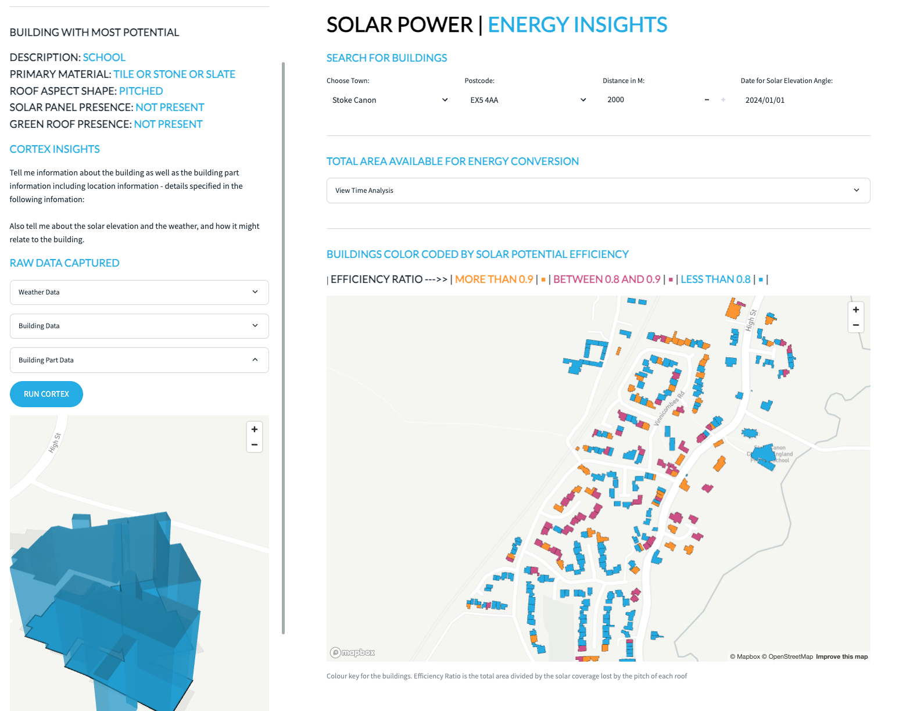

# <h0blue> Analyse and Visualize | </h0blue><h0black>Location Data</h0black> 
 

## <h1sub>Overview</h1sub>

Welcome to the Analyse and Visualise Location Data Hands on Lab.  Today you will learn how to analyse and transform geospatial data in Snowflake.  You will be covering:

- A progressive learning experience from viewing points on a map, right through to building a multi-layer app - which pulls together everything you have learned.

- A use case investigation on sample roof data based on 3 locations within the United Kingdom.  You will pull this together with weather data to understand how much energy can be taken from the current roofs of buildings if solar powered panels were installed.

- An optional use case investigation on how you can call an Api to get the latest flood warnings and how flood risk zones impact the buildings which were loaded in the previous use case.

{: style="width:800px; display: block; margin-left: auto; margin-right: auto;"}

## <h1sub>The lab environment</h1sub>

A complete lab environment has been built for you automatically. This includes:

- **Snowflake Account**: [{{ getenv("DATAOPS_SNOWFLAKE_ACCOUNT","[unknown]") }}](https://{{ getenv("DATAOPS_SNOWFLAKE_ACCOUNT","[unknown]") }}.snowflakecomputing.com)
- **User**: {{ getenv("EVENT_USER_NAME","[unknown]") }}
- **Snowflake Virtual Warehouse**: {{ getenv("EVENT_WAREHOUSE","[unknown]") }}
- **Snowflake Database**: {{ getenv("DATAOPS_DATABASE","[unknown]") }}
- **Schema**: {{ getenv("EVENT_SCHEMA","[unknown]") }}

!!! warning "This lab environment will disappear!"

    This event is due to end at {{ getenv("EVENT_END_DATETIME","[unknown time]") }}, at which point access will be restricted, and accounts will be removed.

## <h1sub>Structure of the session</h1sub>

The Lab consists of three notebooks and two Streamlit applications.

- Completion of the (**ANALYSE_LOCATION_DATA**) notebook. 

    This is an end-to-end tour on how location data works with Snowflake

- Running the Streamlit **ROAD_NETWORK**

    This is an example Streamlit application which brings together the different techniques learnt in notebook 1.  If you wish to tweak or even create a new Streamlit using these ideas you can, just simply **duplicate** the Streamlit first.

- Completion the (**SOLAR_POWER_USECASE**) notebook

    This is an example use case notebook which takes you through how you can use location data regarding the roofs of building to understand potential solar power can be generated.

- Running the Streamlit (**SOLAR_ENERGY_INSIGHTS**)
This is an example Streamlit example which pulls together all the ideas from Notebook 2.  Again, feel free to **duplicate** the Streamlit to make changes.

- Completion the (**LOCATION_DATA_FROM_API**) notebook.
This is an example where you will load data from the **Environmental Agency API** and visualise the flood areas and latest flood warnings.

## <h1sub>Steps for the Lab</h1sub>

1. [Logging in stepping through the initial setup](step1.md)

2. [Begin the Analysing Location Data with Snowflake Tutorial](step2.md)

3. [Begin the Solar Power Use Case](step3.md)

4. [Begin the Location data from an API use case](step4.md)

