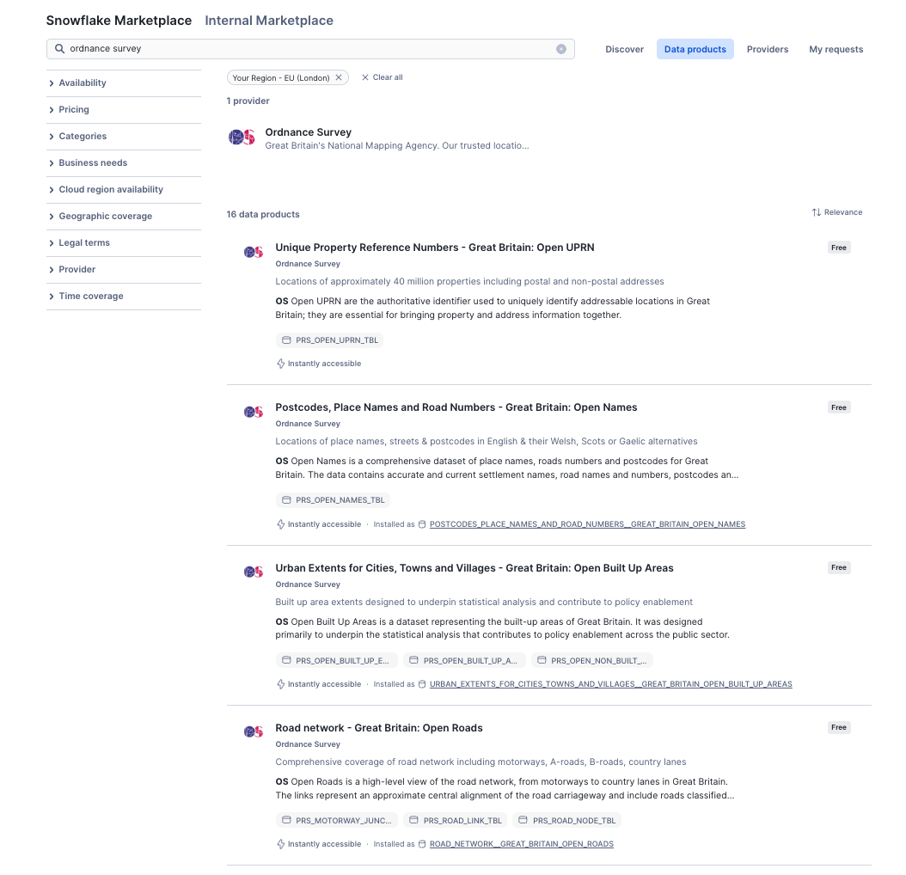
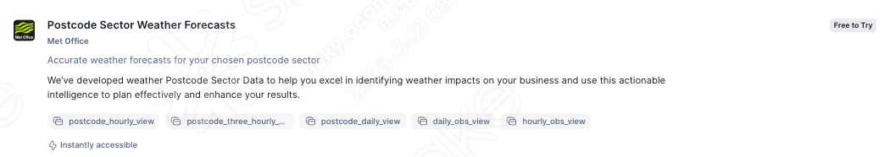
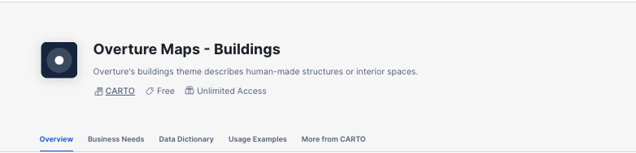

# <h0blue>Complete the Following </h0blue><h0black>Prerequisites</h0black>

Before you can complete the notebooks within snowflake, please follow the following steps:

## <h1sub>Add contact email addresses when prompted.</h1sub>

Once you have logged into snowflake, you will be prompted to add your contact email address.  This is mandatory for obtaining data from the marketplace.  Please populate all the blank email dress fields when prompted with your own email address

## <h1sub>Marketplace data</h1sub>

- From the home page Navigate to **Data Products >> Marketplace**

### <h1grey>Ordnance Survey Datasets</h1grey>

- In the search box provided, search for the following datasets:

    -   Urban Extents for Cities, Towns and Villages
    -   Postcodes, Place Names and Road Numbers
    -   Road Network Great Britain - Open Roads
    -   Unique Property Reference Numbers - Great Britain: Open UPRN
    -   Sample: Buildings - GB: National Geospatial Database
   

- For each dataset found, press **Get** to connect to the dataset.  

{: style="width:800px; display: block; margin-left: auto; margin-right: auto;"}

- Follow the on screen prompts to install each dataset.

### <h1grey>Met office Dataset</h1grey>

Obtain the following trial dataset from the marketplace:

-   Postcode Sector Weather Forecasts

 {: style="width:800px; display: block; margin-left: auto; margin-right: auto;"}

- Press **Start trial** to use the dataset for this lab.  

### <h1grey>Carto Dataset</h1grey> 

Obtain the following trial dataset from the marketplace:

 -   Carto - Overture Maps Buildings

- Press **Get** to use the dataset for this lab.  

 {: style="width:800px; display: block; margin-left: auto; margin-right: auto;"}

