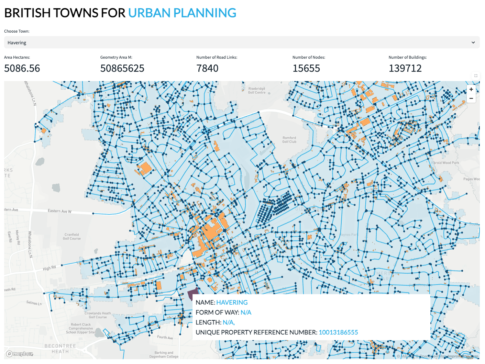

# <h0black>Analyze Location Data | </h0black><h0blue>in Snowflake</h0blue>

Are you ready to start learning about location data in Snowflake?

This tutorial will take you through how you can use location data to perform spatial calculations, joins, and visualise the data using the popular **Pydeck** python package.  We will be using the freely available datasets which you have now installed to step through examples of how geospatial data can be handled.

- Back to the homepage, navigate to **Projects>>Notebooks** 

- Click on **ANALYSE_LOCATION_DATA** to open the notebook.

- Press **Start** to initialise the notebook and follow the instructions within the notebook.

- Once you have completed the notebook navigate to **Projects>Streamlit** and run the **ROAD_NETWORK** app.  This app gives you an example of how you can bring all these datasets together to form a multi layered mapping visual.

{: style="width:800px; display: block; margin-left: auto; margin-right: auto;"}

