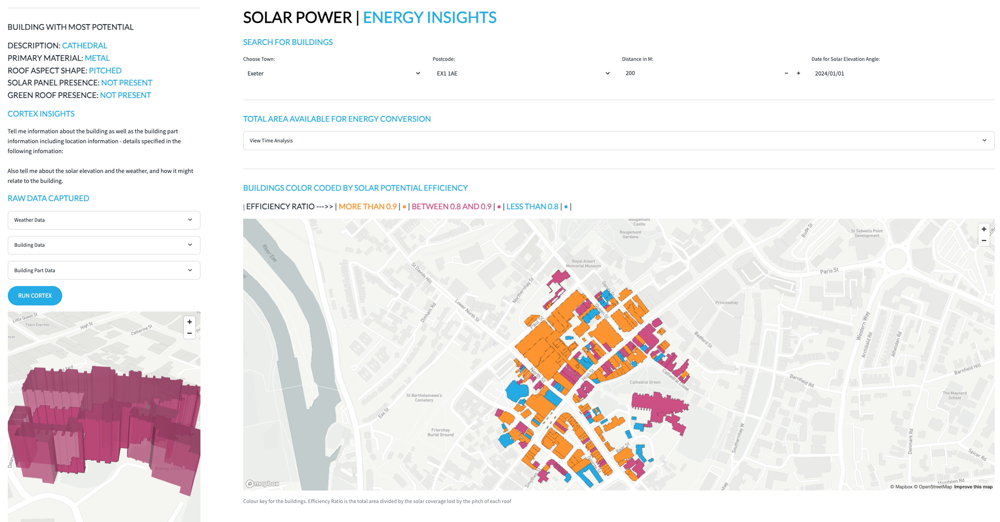

# <h0blue>Solar Power Usecase | </blue><h0black>Slopey Roofs</h0blue>

This tutorial leverages the analytical capabilities of snowflake to understand how efficient or not efficient roofs of buildings are based on how much of the roof is 'pitched' and at what angle the pitch is at.  We will be looking at a sub section of the buildings data which we have just added search optimisation to.  We will allow the user to search within a distance range of a postcode.

- Back to the homepage, navigate to **Projects>>Notebooks** 

- Click on **SOLAR_POWER_USECASE** to open the notebook.

- Press **Start** to initialise the notebook and follow the instructions within the notebook.

- Once you have completed the notebook navigate to **Projects > Streamlit** and run the **SOLAR_ENERGY_INSIGHTS** app.  This app gives you an example of how you can bring all of what you have learnt together to produce an app which illustrates potential energy generated on sample roofs using Solar Power within England.

{: style="width:800px; display: block; margin-left: auto; margin-right: auto;"}

The map also introduces  **Cortex Powered** insights which takes all the information collected (weather and building data) to give an **AI generated summary** of what the user is looking at.