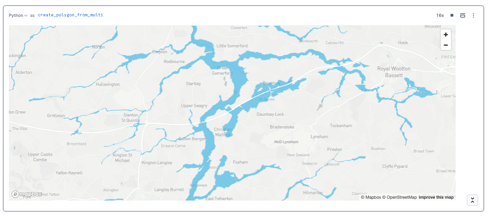
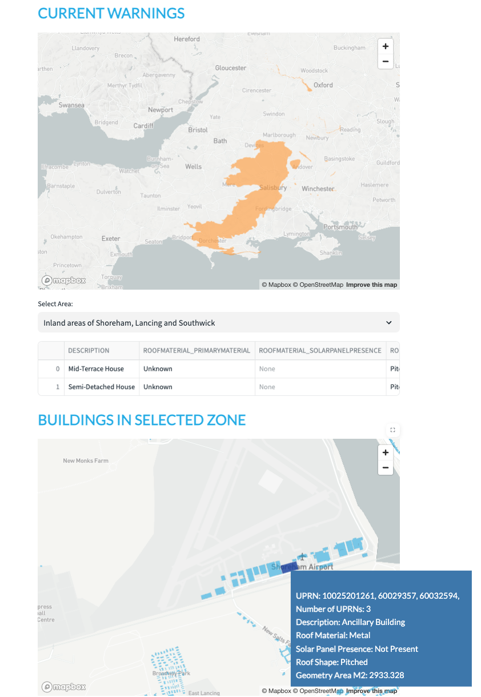

# <h0black>Retrieve real time</h0black> <h0blue>Flood data from an API</h0blue>

After successful completion of the previous step, this tutorial examines how you can ingest flood data from an external API.  In this case, you will be calling the **Environmental Agency**.

- Back to the homepage, navigate to **Projects>>Notebooks** 

- Click on **LOCATION_DATA_FROM_API** to open the notebook.

- Press **Start** to initialise the notebook and follow the instructions within the notebook.

{: style="width:800px; display: block; margin-left: auto; margin-right: auto;"}

- Navigate to the streamlit app **FLOOD_ZONES** to see a simple app containing the current flood zones plus buildings inside a flood area.

