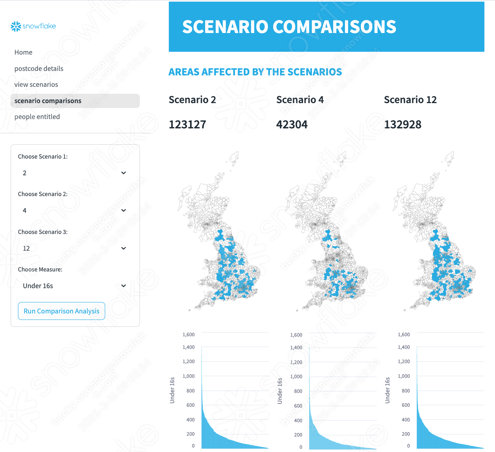

# <h0black>Cold Weather Payment | </h0black><h0blue>Simulator</h0blue>

This is an example which takes data from the met office as well as synthetic **people data** to create a cold weather payment simulator based on certain criteria being met. 

- Back to the homepage, navigate to **Projects>>Streamlits** 

- Click on **COLD_WEATHER_PAYMENTS** to open the Streamlit.

In here you will be able to create and save scenarios then view various outputs by clicking through the pages in the sidebar

{: style="width:800px; display: block; margin-left: auto; margin-right: auto;"}

There is a supporting notebook to give you an understanding about what calculations were used.  As well as the location based spatial filtering, time series analysis was also used using features such as **moving average** in order to calculate the benefit entitlement

## <h1sub>Marketplace dataset required </h1sub>

**Please note:**  

For some of this section, you will need to get the following marketplace dataset from Ordnance Survey:
- Postcodes, Place Names and Road Numbers

## <h1sub>Notebook for Analysis</h1sub>

- Back to the homepage, navigate to **Projects>>Notebooks** 

- Click on **COLD_WEATHER_PAYMENTS_ANALYSIS** to open the notebook.

- Press **Start** to initialise the notebook and follow the instructions within the notebook.
