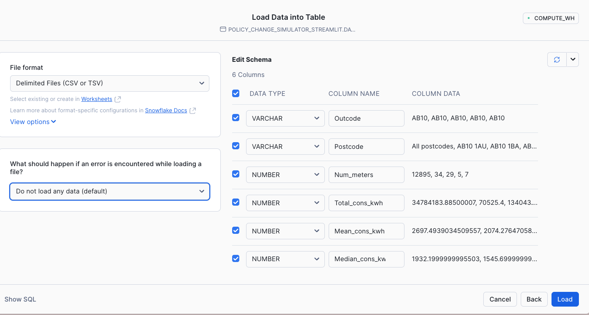

# <h0black> Analyze and Share Data with | </h0black><h0blue> Private Listings</h0blue>

So in summary we have looked at some techniques to understand the who, the when and the where.  This is all featured around the impacts of cold weather payments.  Another impact might be the cost of energy.  For this exercise you will experience data sharing between one another.
<hr>


You will be experiencing the following: 

-   Ingesting data using the User Interface

-   Sharing the data using Provider Studio, 

-   Using a share from another hands on lab delegate 

-   Analysing data from both local and shared data.

<hr>

## <h1sub>Marketplace dataset required</h1sub>

**Please note:**  

For some of this section, you will need to get the following marketplace dataset from Ordnance Survey:
- Postcodes, Place Names and Road Numbers

<hr>

## <h1sub> Ingesting data </h1sub>
You saw before how to create a streamlit app - and then leveraged the notebook to analyse the data.

What if we want more data?  There are lots of ways to ingest data.  For this section we will do a simple approach.  There is a dataset which features pre pay meter data.

Click on the links below to see an example data set you could use to complement the existing datasets.

https://www.gov.uk/government/statistics/postcode-level-electricity-statistics-2022

https://www.gov.uk/government/statistics/postcode-level-gas-statistics-2022

#### Gas Or Electric??

Some of you will be providers of Electric, others will be providers of gas

- Choose someone to work with and decide who will be ingesting **gas data** and who will be ingesting **electric data**. 

>The Gas provider needs to download [**this**](https://assets.publishing.service.gov.uk/media/65b10088160765001118f7bd/Postcode_level_gas_2022.csv)

- Choose Postcode level all domestic meters electricity 2022

>The Electric provider needs to download [**this**](https://assets.publishing.service.gov.uk/media/65b0d1c2f2718c0014fb1be5/Postcode_level_all_meters_electricity_2022.csv)

- Choose postcode level domestic gas 2022


- Once you have downloaded your designated CSV file, switch back to the home page in Snowflake by clicking on the house.

## <h1sub> Ingest the Data </h1sub>

- Click on **DATA** and select the database **DATAOPS_EVENT_PROD**

- Select the schema **DATA** then on the top right hand corner, navigate and select **Create Table from File**

    

-   Press Browse and find the file you have downloaded on your laptop

    

- Create a new table called **Energy_usage_postcode** then press Next.


    


-   Check the column names are as expected then press Load

    

- After about 5 seconds you should get something like this:

    

-   Press **Done**

## <h1sub>Creating a new Notebook</h1sub>

- Go back to the Home page and Select Projects
- Select **Notebooks** and press + Notebook to create a new notebook
- Give the notebook the name *Energy Usage*
- For Notebook location, choose **DATAOPS_EVENT_PROD**
- For Schema, change it from Public to **Notebooks**
- For Notebook warehouse, select **DEFAULT_WH**
- Press **Create**

## <h1sub> Adding packages and import libraries</h1sub>

-   Same as earlier, add the **pydeck** by importing the package

- You will notice that the notebook will come pre-installed with a sample notebook.  We will not be using cell 2 and 3.

- Using the 3 dots in cell 2, click on them and press **Delete**

    

- Using the 3 dots in cell 3, click on them and press **Delete**

- Run cell 1

-   Add a new **python** cell in the notebook


```python

from snowflake.snowpark import functions as F
from snowflake.snowpark import types as T
meter_data = session.table('DATA.ENERGY_USAGE_POSTCODE')
meter_data.limit(10)

```

You will see that there is a column that says 'All postcodes - this dataset has summary data for each postcode area.  This is useful as the cold weather payment is worked out by postcode area.

- Add a new **python** cell to only retrieve data for each postcode area.

```python

meter_data_pcd_area = meter_data.filter(F.col('POSTCODE')=='All postcodes').drop('POSTCODE')
meter_data_pcd_area

```


- Create another **python** cell which shows the detail version.

```python
meter_data_pcd = meter_data.filter(F.col('POSTCODE')!='All postcodes')
meter_data_pcd.sample(0.05)

```
<hr>

##<h1sub> Prepare Secure Views of data for Sharing</h1sub>
Now as a data provider, I would like to share this data in this format to other organisations.  For this we need to create secure views of the data (or tables/dynamic tables)

- Add a new **python** cell to convert these dataframes to views. **IMPORTANT** replace the word Electric with **Gas** on both view names if you have ingested **gas** data.

```python

meter_data_pcd.create_or_replace_view('DATA."Electric Meter by Postcode"')
meter_data_pcd_area.create_or_replace_view('DATA."Electric Meter by Postcode Area"')


```

Once created you will see 2 views appear in the data schema. You can see this by toggling from **Files** to **Databases** within the left hand window pane.


As we are sharing the data, we need to make these views secure.  
- Create a **SQL** cell and copy and paste the following into it.  Again, if you are a provider of **gas** data, change the word Electric to **Gas**.

```sql

ALTER VIEW DATA."Electric Meter by Postcode" SET SECURE;
ALTER VIEW DATA."Electric Meter by Postcode Area" SET SECURE;


```


## <h1sub> Create a Private Listing </h1sub>

We will now create a private listing using provider studio.


- Go to the home page and click **Leave** to leave the notebook.

- Navigate to Data Products, then **Provider Studio**


- Click on the + Listing button

    

- Call the listing Energy Usage **ELECTRIC OR GAS** and make sure **Only Specified Customers** is selected

    

- Press **Next**

- In the Whats in the listing button, navigate to the 2 new secure views.

    

-   Select them with the tick boxes then press **Done**

-   Rename the secure share identifier to **ENERGY_USAGE**

- In the Briefly Describe your listing section, type in a short summary which describes your dataset.

- Under Add consumer accounts area, choose your the consumer account to share with by typing the identifier into the **add consumer account** box. 


- Press **Publish**


    


Once the assigned provider of the other energy source has shared their data, you will be able to see it in Private sharing.

 - Go to **Private Sharing** and the new dataset should appear.


**Get** the data.  


##<h1sub> Analysing both local and shared data from a private listing</h1sub>

So you should now have access to both **gas** and **electricity** data.  One local and one from a share.

If you haven't already done so, get the other energy listing data from the private shares.  

> **HINT** You have already done this step before with the initial data share. The new Data share will be in the Private Sharing area.

- Go back to the Energy Usage notebook 

- Rerun cell 1 and two to ensure we have imported the right libraries. 

- scroll to the bottom add a **SQL** cell.


```sql

CREATE OR REPLACE VIEW "Energy by Postcode Area"

as
SELECT *, 'GAS' as "Energy Type" FROM ENERGY_USAGE__GAS.DATA."Gas Meter by Postcode Area"

UNION 

SELECT *, 'ELECTRIC' as "Energy Type" FROM DATA."Electric Meter by Postcode Area"

```

- Run the cell.

You have just created a simple view which combines the two datasets together.

>Note - The above sql will fail for the Gas provider - you will need to change the database paths.  The Electric Provider will only need supply the schema and table as the notebook is saved inside the database where the data is situated.   You can see the exact paths by selecting the Databases tab within the left hand pane.

- Add a **python** cell to load the data from the view into a dataframe

```python

total_energy_area = session.table('"Energy by Postcode Area"')

total_energy_area;

```

- Create a **basic** dataframe in a new **python** cell which views both datasets

```python


total_energy = total_energy_area.group_by('"Energy Type"').agg(F.sum('NUM_METERS'),
                                          F.mean('MEAN_CONS_KWH'),
                                          F.median('MEDIAN_CONS_KWH'))

total_energy


```

We will now add some **variables** to change the price cap as well as the current prices of gas and electric

- Copy and paste the following code in a new **python** cell

```python

electric_KWh = st.number_input('Electric KWh in pence',1.00,30.00,22.36)
gas_KWh = st.number_input('Gas KWh in pence',1.00,7.00,5.48)
price_cap = st.number_input('Price Cap',1,6000,2000)

```


Next apply the price variables for gas and electric to the data

- Copy and paste the following code in a new **python** cell
```python

total_energy_avg_price = total_energy.with_column('Price',F.when(F.col('"Energy Type"')=='GAS',
                                        F.col('AVG(MEAN_CONS_KWH)')*F.lit(gas_KWh/100)).else_(F.col('AVG(MEAN_CONS_KWH)')*F.lit(electric_KWh/100)))

total_energy_avg_price

```


Next add the % change of prices based on the price cap variable

- Copy and paste the following code in a new **python** cell
```python

price_cap_change = total_energy_avg_price.agg(F.sum('PRICE')).with_column('cap_price',
                                                                          F.lit(price_cap)).with_column('% change',
                                                                                                        F.div0('SUM(PRICE)',
                                                                                                               'CAP_PRICE'))

price_cap_change

```


Finally apply the % change to all postcode areas
- Copy and paste the following code in a new **python** cell

```python

total_energy_area_changes = total_energy_area.with_column('Price',F.when(F.col('"Energy Type"')=='GAS',
                                        F.col('MEAN_CONS_KWH')*F.lit(gas_KWh/100)).else_(F.col('MEAN_CONS_KWH')*F.lit(electric_KWh/100)))

total_energy_area_changes = total_energy_area_changes.\
join(price_cap_change.select('"% change"')).with_column('"New Price"',
                                                    F.col('PRICE')+ F.col('PRICE')*F.col('"% change"'))

total_energy_area_changes

```


## <h1sub> Create a heatmap using H3 using the detailed energy information</h1sub>

- Create a new view using a new **SQL** cell - NB. You will need to modify the select statement for the gas providers - again, same as before, look at the databases area to find exact path name.  (this is within the share)

```SQL

CREATE OR REPLACE VIEW DATA."Energy by Postcode Detail"

as

SELECT *, 'GAS' as "Energy Type" FROM ENERGY_USAGE__GAS.DATA."Gas Meter by Postcode"

UNION 

SELECT *, 'ELECTRIC' as "Energy Type" FROM DATA."Electric Meter by Postcode"


```
- Create a new **python** cell which will forecast the average price of fuel per postcode.  We will also join to the postcode dataset provided by **Ordnance Survey**


```python

total_energy_detail = session.table('DATA."Energy by Postcode Detail"')

total_energy_detail_changes = total_energy_detail.with_column('Price',F.when(F.col('"Energy Type"')=='GAS',
                                        F.col('MEAN_CONS_KWH')*F.lit(gas_KWh/100)).else_(F.col('MEAN_CONS_KWH')*F.lit(electric_KWh/100)))

total_energy_detail_changes = total_energy_detail_changes.\
join(price_cap_change.select('"% change"')).with_column('"New Price"',
                                                    F.col('PRICE')+ F.col('PRICE')*F.col('"% change"'))

postcodes = session.table('POSTCODES_PLACE_NAMES_AND_ROAD_NUMBERS__GREAT_BRITAIN_OPEN_NAMES.PRS_OPEN_NAMES_SCH.PRS_OPEN_NAMES_TBL')

postcodes = postcodes.with_column('LAT',F.call_function('ST_Y',F.col('GEOGRAPHY')))
postcodes = postcodes.with_column('LON',F.call_function('ST_X',F.col('GEOGRAPHY')))

postcodes = postcodes.select('NAME1','LAT','LON')
fuel_cost = total_energy_detail_changes.join(postcodes,postcodes['NAME1']==total_energy_detail_changes['POSTCODE'])
fuel_cost = fuel_cost.group_by('POSTCODE').agg(F.any_value('LAT').alias('LAT'),
                                              F.any_value('LON').alias('LON'),
                                              F.mean('"New Price"').alias('"New Price"'),
                                              F.mean('PRICE').alias('"Price"'))

```

Index the latitude and longitude and group by **H3**

- Create a new python cell using the code below:

```python

H3 = fuel_cost.with_column('H3',F.call_function('H3_LATLNG_TO_CELL_STRING',F.col('LAT'),F.col('LON'),F.lit(5)))\
.group_by('H3').agg(F.mean('"Price"').alias('"Current_Price"'),
                   F.mean('"New Price"').alias('"New_Price"'))

```
Now we will leverage the previously installed **pydeck** package to render a map in H3.

- Copy and paste the following python code below:

```python

import pydeck as pdk

H3pd = H3.to_pandas()

color_scheme = f"""[
    0 * (New_Price/{price_cap} < 1) + 255 * (New_Price/{price_cap} >= 1),
    114 * (New_Price/{price_cap} < 1) + 100 * (New_Price/{price_cap} >= 1),
    189 * (New_Price/{price_cap} < 1) + 0 * (New_Price/{price_cap} >= 1)
    ]"""


h3 = pdk.Layer(
        "H3HexagonLayer",
        H3pd,
        pickable=True,
        stroked=True,
        filled=True,
        extruded=False,
        get_hexagon="H3",
        get_fill_color=color_scheme,
        line_width_min_pixels=0,
        opacity=0.4)

#### render the map showing trainstations based on overture maps

tooltip = {
   "html": """<b>H3:</b> {H3} <br> <b>New Price:</b> {New_Price}""",
   "style": {
       "width":"50%",
        "backgroundColor": "steelblue",
        "color": "white",
       "text-wrap": "balance"
   }
}

st.pydeck_chart(pdk.Deck(
    map_style=None,
    initial_view_state=pdk.ViewState(
        latitude=53,
        longitude=2.4,
        zoom=5,
        height=600
        ),
    
layers= [h3], tooltip = tooltip

))

```


- You should see a **map** like this:

    

Blue indicates households who will be typically below the price cap and orange indicate above the price cap.  There are various parts which are not covered.  This may be because these areas have postcodes that cover a much wider area than the H3 cells can fit.  You can correct this by leveraging polygons of all the boundaries and filling them with H3 cells.

**Well done**, you have created a share to enrich your own data in order to find out what the average yearly cost of fuel will be across all postcode areas and depending on the simulated price cap.  Feel free to reuse any of the code provided in this lab for your own Hackathon project.


#### Useful Documentation

- [Load Data From the UI](https://docs.snowflake.com/en/user-guide/data-load-web-ui)

- [Secure Views](https://docs.snowflake.com/en/user-guide/views-secure)

- [Creating listing](https://other-docs.snowflake.com/en/collaboration/provider-listings-creating-publishing)


